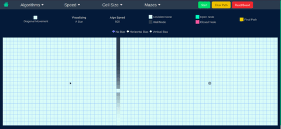
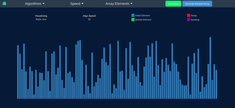

An Algorithms Visualized made using Vue and TypeScript

> # Live
>
> https://algos-viz.netlify.app/

# Demo

# Algorithms Implemented

## Sorting Algorithms

1. Bubble Sort
2. Insertion Sort
3. Selection Sort
4. Merge Sort
5. Quick Sort
6. Heap Sort
7. Radix Sort
8. Bogo Sort :)

## Maze Generation Algorithms

1. Randomized DFS
2. Recursive Division
3. Eller's Algorithm
4. Random Maze

## Path Finding Algorithms

1. A Star
2. Dijkstra's Algorithm
3. Breadth First Search
4. Depth First Search

## Data Structures Related Algorithms

### Linked List

1. Insertion and Deletion
2. Reversing a Linked List

### Binary Trees

1. Insertion & Deletion in a Binary tree
2. Inveting a Binary Tree

### Heaps

1. Insertion and Deletion in a Minimum and Maximum Heap
